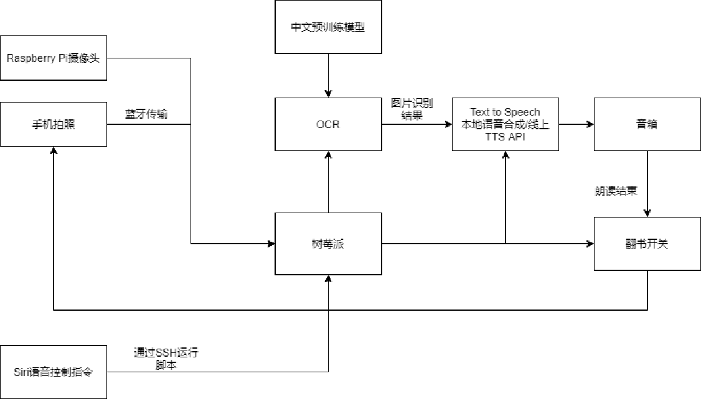

# Let_RaspberryPi_Read_For_U
Project of Advanced Embedded Systems, A Book Reading Robot

System Design:

TODO:

- [x] OCR
- [x] TTS
- [x] iPhone/iPad Siri SSH Control RaspberryPi
- [ ] Page Turning
- [ ] Bluetooth Connection
- [ ] Raspberry Pi Camera

Reference:

- https://www.bilibili.com/video/BV1hQ4y1A7og?from=search&seid=13980787961300309063

- https://m.baidu.com/video/page?pd=video_page&nid=575444300131719648&sign=4290702759082228960&word=%E6%9C%BA%E5%99%A8%E7%BF%BB%E4%B9%A6&oword=%E6%9C%BA%E5%99%A8%E7%BF%BB%E4%B9%A6&atn=index&frsrcid=4185&ext=%7B%22jsy%22%3A1%7D&top=%7B%22sfhs%22%3A1%2C%22_hold%22%3A2%7D&sl=4&fr0=A&fr1=A&lid=11164368489193631176&referlid=11164368489193631176&ms=1&frorder=3&_t=1627031199470